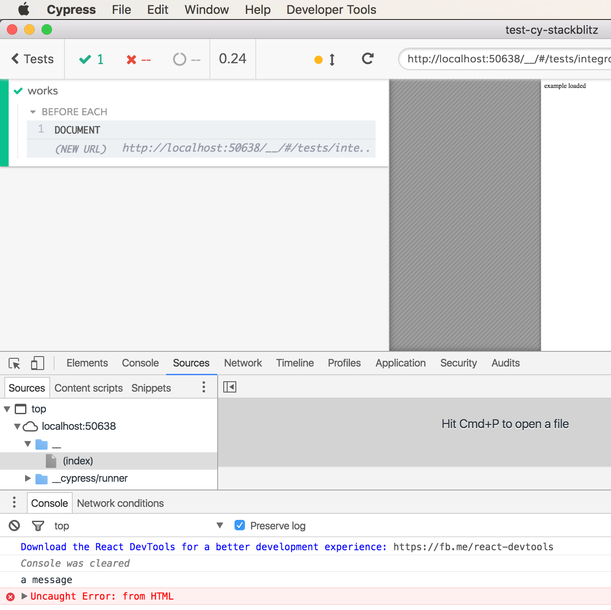
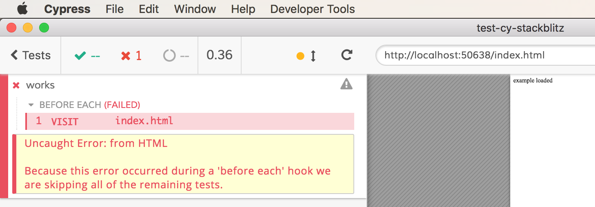

If we write document contents the thrown errors will be hidden and do not appear in the Cypress reporter

See [cypress/integration/error-not-shown-spec.js](cypress/integration/error-not-shown-spec.js)

```js
// as as file "index.html"
const html = `
<!DOCTYPE html>
<html>
<head>
  <title></title>
</head>
<body>
  example loaded
  <script>
    console.log('a message')
    throw new Error('from HTML')
  </script>
</body>
</html>
`

beforeEach(() => {
  cy.document().then(doc => {
    doc.write(html)
    doc.close()
  })
})

it('works', () => {})
```



If we load same file using `cy.visit()` everything is shown in the reporter. See test [cypress/integration/error-shown-spec.js](cypress/integration/error-shown-spec.js)


